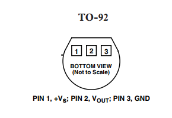

# TMP36 temperatuuriandur

TMP36 on levinud temperatuuriandur. Anduri tööpõhimõte põhineb sisseehitatud termoelektrilisel elemendil, mis teisendab mõõdetud temperatuuri lineaarseks analoogpinge signaaliks. TMP36 väljundpinge on proportsionaalne temperatuuriga: iga 1 °C muutus põhjustab umbes 10 mV pingekõikumist. Näiteks annab andur 0 °C juures pingeks umbes 500 mV ja 25 °C juures umbes 750 mV, millest on lihtne arvutada tegelik temperatuur, kasutades valemit, mis arvestab nii lineaarset nihket kui ka pinge muutust. Andur töötab toitepinge vahemikus 2,7V kuni 5,5V

TMP36 andureid on võimalik leida erinevates korpustes või pakendi tüüpides *(ingl package type)* Meie vaatame siin kõige levinumat TO-92 pakendis TMP36 andurit. Selles pakendis on anduril kolm viiku - toitepinge (1), väljund (2) ja maandus (3).

*Allikas: https://www.arduino.cc/en/uploads/Main/TemperatureSensor.pdf*

Anduri väljundist loetava pinge ja mõõdetava temperatuuri suhet kirjeldab järgmisel graafikul joon b. Nagu näeme on tegemist lineaarse suhtega. Graafikult saame välja lugeda, et sensori mõõtevahemik on -40°C - 125°C 

Allikas: https://www.arduino.cc/en/uploads/Main/TemperatureSensor.pdf

## TMP36 liidestamine Arduino UNO-ga ja näidu teisendamine Celsiuse kraadideks

Arduino UNO puhul on mõistlik kasutada TMP36 toitepingeks 5V. Maanduseks sobib ükskõik milline Arduino GND viik. Anduri näitu loeme analoogviiguga.

Peale analoogviigult näidu lugemist (saame täisarvu vahemikus 0 - 1023), tuleb see teisalda voltideks. Seda saame teha järgmiselt:

$voldid=sensori\_{näit}*(5/1023)$

Ülaltoodud graafikult näeme, et 0 kraadi Celsiuse juures on sensori näit 0.5V - see on meie nihe. Samuti näeme, et sensori väljundi muutus 0.1V tähendab temperatuuri kasvu 10 kraadi Celsiuse võrra. Seega saame temperatuuri arvutada järgmiselt:

$temperatuur=(voldid-0.5)*100$

[Interaktiivne simulatsioon](https://www.tinkercad.com/things/aYrG2vh1uUn-tmp36?sharecode=k2pp1kucaxTrZC0PG6rnkitRuZ47a5o3cB9-ljA1rHg)

Näitekood:
~~~cpp
#define tmp36 A0
float voldid, temperatuur;

void setup() {
  Serial.begin(9600);
}

void loop() {
  int tmp36Data = analogRead(tmp36);// Loeme anduri väärtuse
  voldid = tmp36Data * (5.0 / 1023.0); // Teisendame väärtuse pingeks
  temperatuur = (voldid - 0.5) * 100.0;  // Teisendame pingest temperatuuriks
  Serial.print("Moodetud pinge: ");
  Serial.print(voldid);
  Serial.print(" V, Temperatuur: ");
  Serial.print(temperatuur);
  Serial.println(" *C");
  delay(1000);  // Ootame 1 sekundi enne järgmist mõõtmist
}

~~~